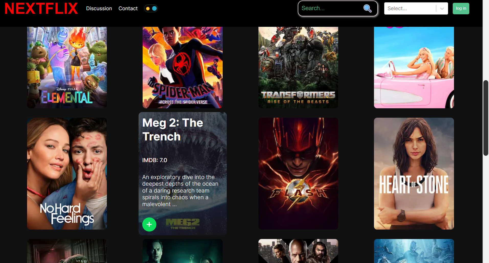
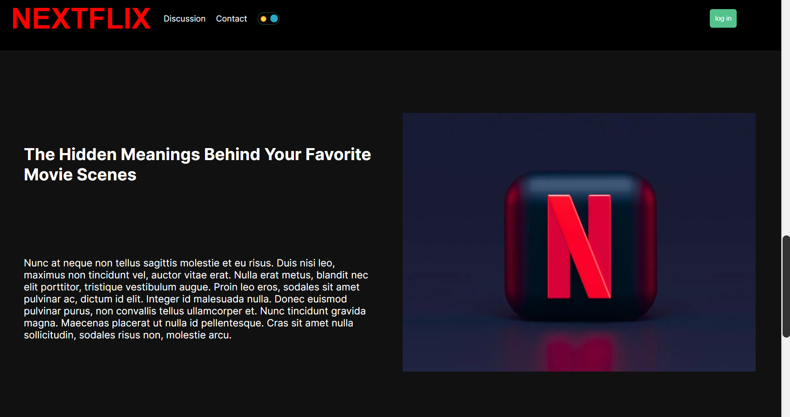
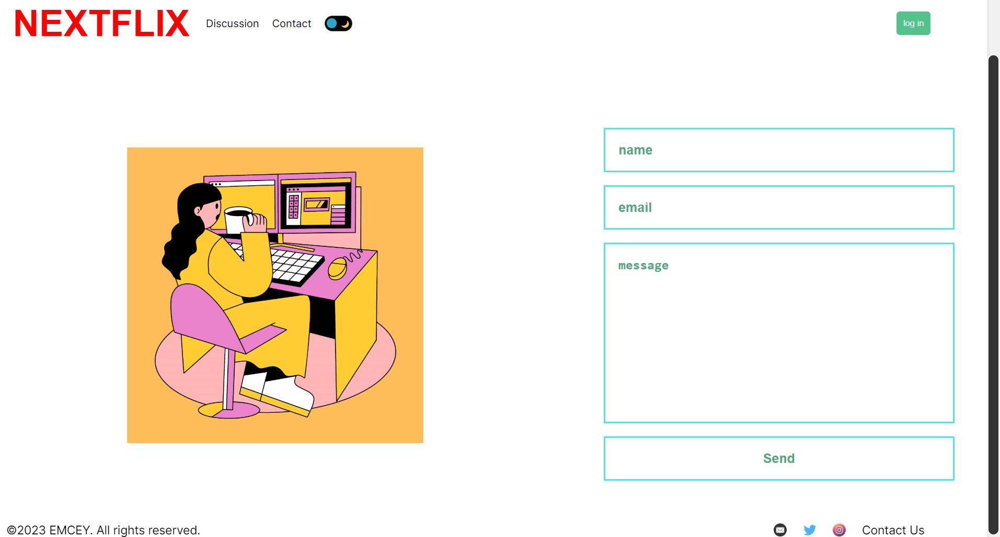
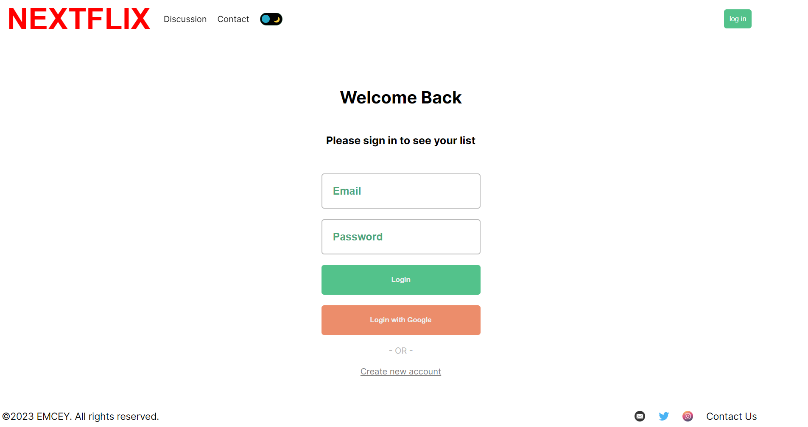
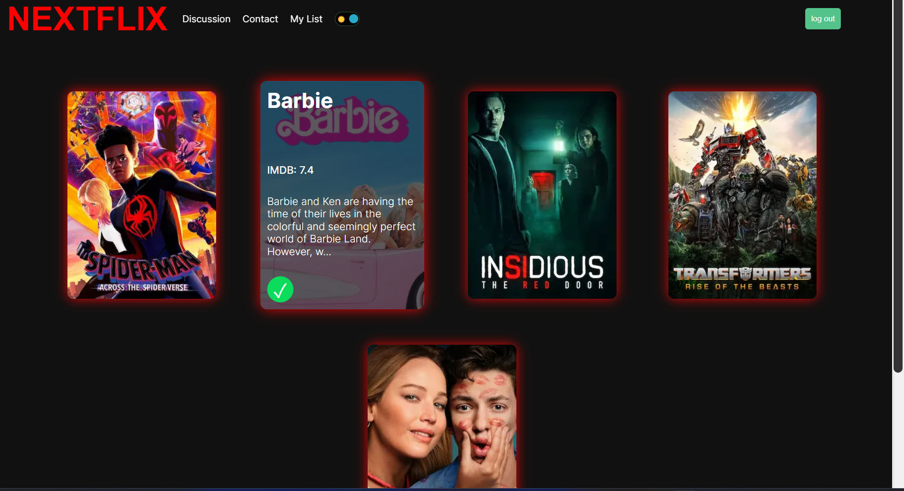

# Nextflix

Nextflix is a web app that allows you to discover and create your own movie lists, as well as read articles from in the discussion section. You can also create your own movie lists and discover new titles based on your preferences. Nextflix is powered by Next.js, a React framework that supports server-side rendering and static site generation. Nextflix also uses Next-Auth for authentication, MongoDB for database, and Axios for fetching data from external APIs. Nextflix is licensed under the Creative Commons Attribution-NonCommercial 4.0 International License, which means you can use, modify, and share it for non-commercial purposes, as long as you give credit to the original author.

## Getting Started

To run Nextflix locally, you need to have Node.js and MongoDB installed on your machine. Then, follow these steps:

1. Clone this repository
2. Install the dependencies: `npm install`
3. Create a `.env` file in the root directory and add the following variables:

   - `MONGODB_URI`: The connection string to your MongoDB database
   - `NEXTAUTH_URL`: The base URL of your application (e.g., `http://localhost:3000`)
   - `MOVIE_API_KEY`: The API key for the movie data source (e.g., https://www.themoviedb.org/)
4. Start the development server: `npm run dev`
5. Open your browser and go to `http://localhost:3000`

## Screenshots

    
